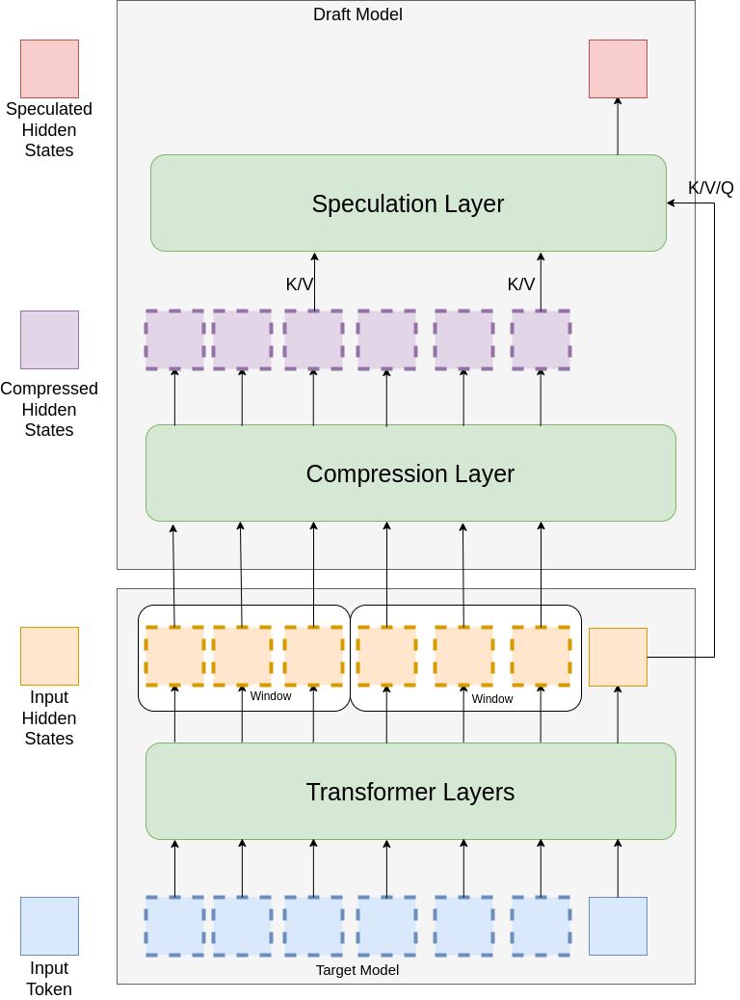

# CAMEL

## Introduction

CAMEL(Context-Aware Modifier for Efficient Language model) is a speculative decoding method inspired by [EAGLE](https://github.com/SafeAILab/EAGLE). It compresses former input hidden states according to window size and then make speculations.

<div align="center">
    
</div>

## Installation

```bash
pip install modifier
```

## Quick Start

CAMEL only supports `meta-llama/Llama-2-7b-chat-hf` currently.

```python
import torch
from camel import CamelModel

prompt = "What is artificial intelligence?"
model = CamelModel.from_pretrained(
    base_model_path="meta-llama/Llama-2-7b-chat-hf",
    modifier_path="0xWe11es/camel-llama2-h1024-w1",
    torch_dtype=torch.float16,
    device_map="auto"
)
tokenizer = model.get_tokenizer()
input_ids = tokenizer(prompt).input_ids
output_ids = model.generate(input_ids)
output = tokenizer.decode(output_ids)
print(output)
```

CAMEL has the following modifier based on Llama2 (`h` stands for hidden size, `w` stands for window size):

- [0xWe11es/camel-llama2-h256-w1](https://huggingface.co/0xWe11es/camel-llama2-h256-w1)
- [0xWe11es/camel-llama2-h256-w4](https://huggingface.co/0xWe11es/camel-llama2-h256-w4)
- [0xWe11es/camel-llama2-h256-w16](https://huggingface.co/0xWe11es/camel-llama2-h256-w16)
- [0xWe11es/camel-llama2-h256-w64](https://huggingface.co/0xWe11es/camel-llama2-h256-w64)
- [0xWe11es/camel-llama2-h1024-w1](https://huggingface.co/0xWe11es/camel-llama2-h1024-w1)
- [0xWe11es/camel-llama2-h1024-w4](https://huggingface.co/0xWe11es/camel-llama2-h1024-w4)
- [0xWe11es/camel-llama2-h1024-w16](https://huggingface.co/0xWe11es/camel-llama2-h1024-w16)
- [0xWe11es/camel-llama2-h1024-w64](https://huggingface.co/0xWe11es/camel-llama2-h1024-w64)

## Performance

We test modifier `0xWe11es/camel-llama2-h1024-w4` on several datasets, and get the following results compared to vanilla model (hf version).

| Dataset  | Model       | Temperature | Speed(Token/s) | Speedup |
|----------|-------------|-------------|----------------|---------|
| MT-Bench | LlaMa2 7B   | 0.0         | 71.85          | 1.92x   |
| MT-Bench | LlaMa2 7B   | 1.0         | 57.54          | 1.62x   |
| GSM8K    | LlaMa2 7B   | 0.0         | 73.51          | 2.20x   |
| GSM8K    | LlaMa2 7B   | 1.0         | 57.15          | 1.77x   |
| Alpaca   | LlaMa2 7B   | 0.0         | 68.92          | 1.88x   |
| Alpaca   | LlaMa2 7B   | 1.0         | 55.38          | 1.56x   |

## Reference

- [Medusa](https://github.com/FasterDecoding/Medusa)

- [EAGLE](https://github.com/SafeAILab/EAGLE)